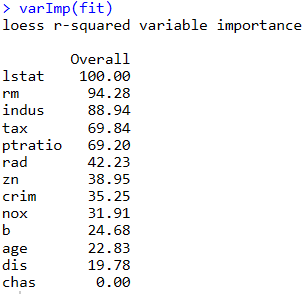

# K-Nearest Neighbors (KNN) Classification and Regression

This project demonstrates the use of the K-Nearest Neighbors (KNN) algorithm for both classification and regression tasks in R.

## Project Overview

The project consists of two main parts:

1. **Classification (Student Application)**: Predicts whether a student will be admitted to a university based on various features like GPA.
2. **Regression (Boston Housing)**: Predicts house prices based on different factors such as crime rate, property tax rate, and others.

Both tasks use the `caret` package for model training and evaluation.

## Dependencies

The following R libraries are used in this project:

- `caret` - for training and tuning machine learning models.
- `pROC` - for performance evaluation and ROC analysis.
- `mlbench` - for the Boston Housing dataset.

To install the necessary packages, run the following in R:

```R
install.packages(c("caret", "pROC", "mlbench"))
```

## Project Details

### 1. Classification (Student Application)
We classify student admission based on various features using K-Nearest Neighbors. The dataset is partitioned into a training set (70%) and a test set (30%). We use repeated cross-validation (10-fold, 3 repeats) to train the KNN model and optimize the number of neighbors (k) based on ROC performance.

- Training the Model:


- Results:
plotting the ROC curve and calculating the area under the curve (AUC) for the best value of K=29


- Evaluating Model Performance:


### 2. Regression (Boston Housing)




