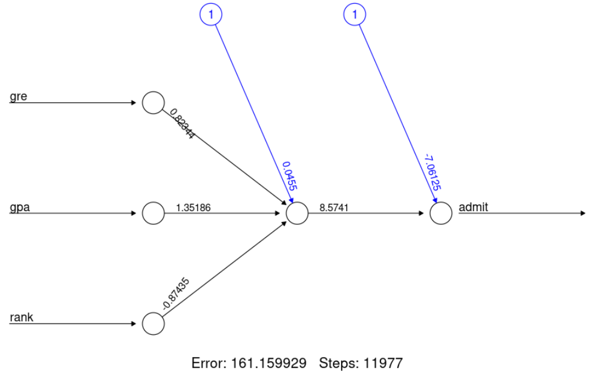
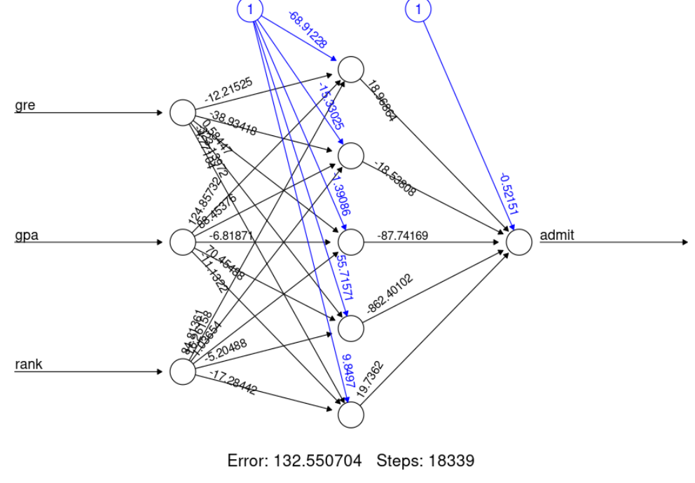
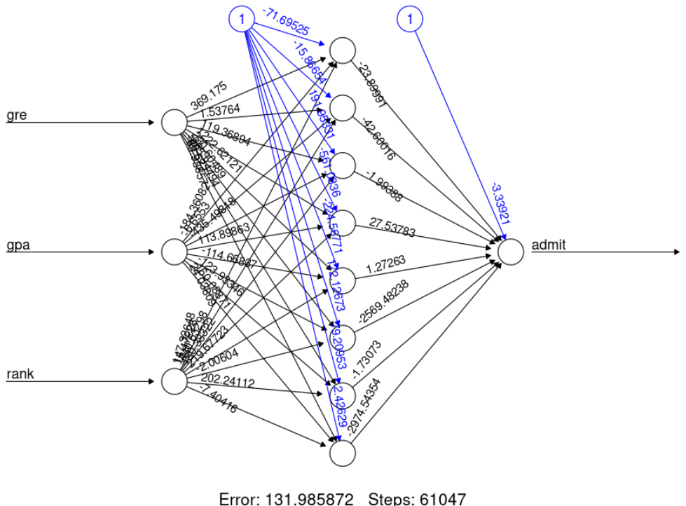
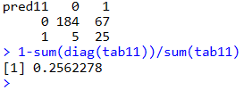
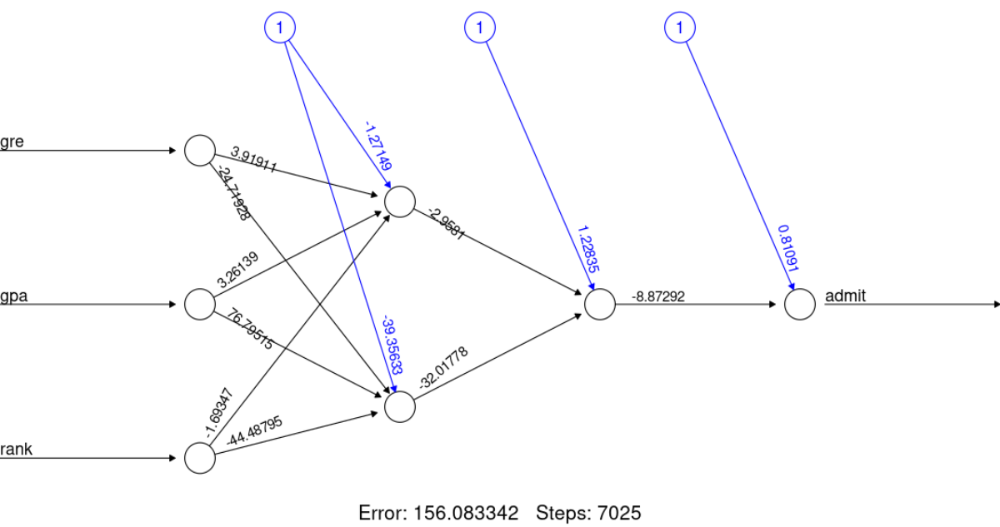

# Neural Network for Graduate School Admissions

This repository contains an R script that builds and evaluates **Neural Network** models to predict graduate school admissions based on features such as GRE score, GPA, and university rank. The project demonstrates how to preprocess data, build neural networks with different architectures, and evaluate their performance using confusion matrices and misclassification error.

---

## Dataset

The dataset used in this project is `binary.csv`, which contains the following columns:
- **admit**: Binary target variable (1 = admitted, 0 = not admitted).
- **gre**: Graduate Record Examination score.
- **gpa**: Grade Point Average.
- **rank**: Prestige rank of the undergraduate institution (1 = highest, 4 = lowest).

```R
data <- read.csv('https://raw.githubusercontent.com/bkrai/R-files-from-YouTube/main/binary.csv')








a neural network model with 5 nodes gives better accuracy than a model with 1 or 8 nodes

accuracy on training set


accuracy on testing set


model with 2 hidden layers


