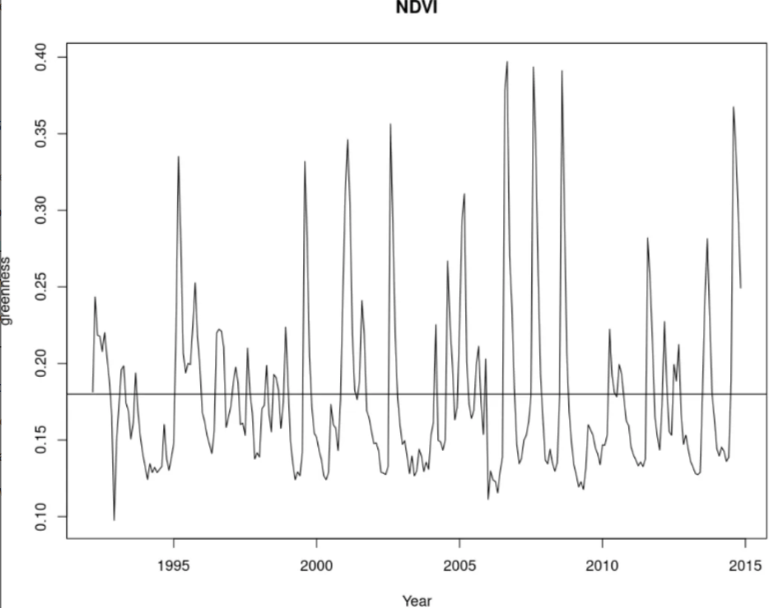
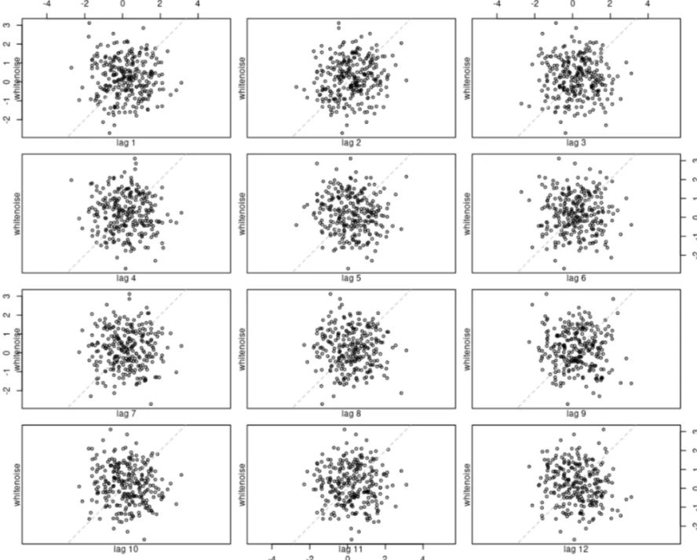
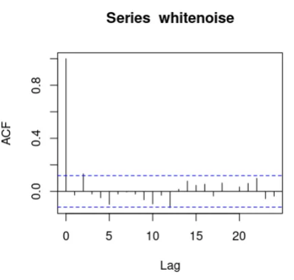
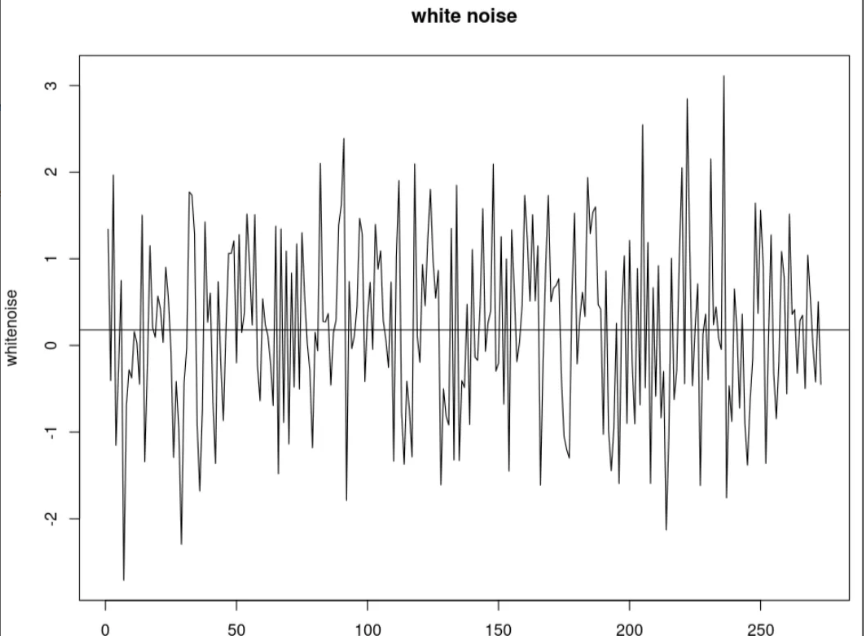
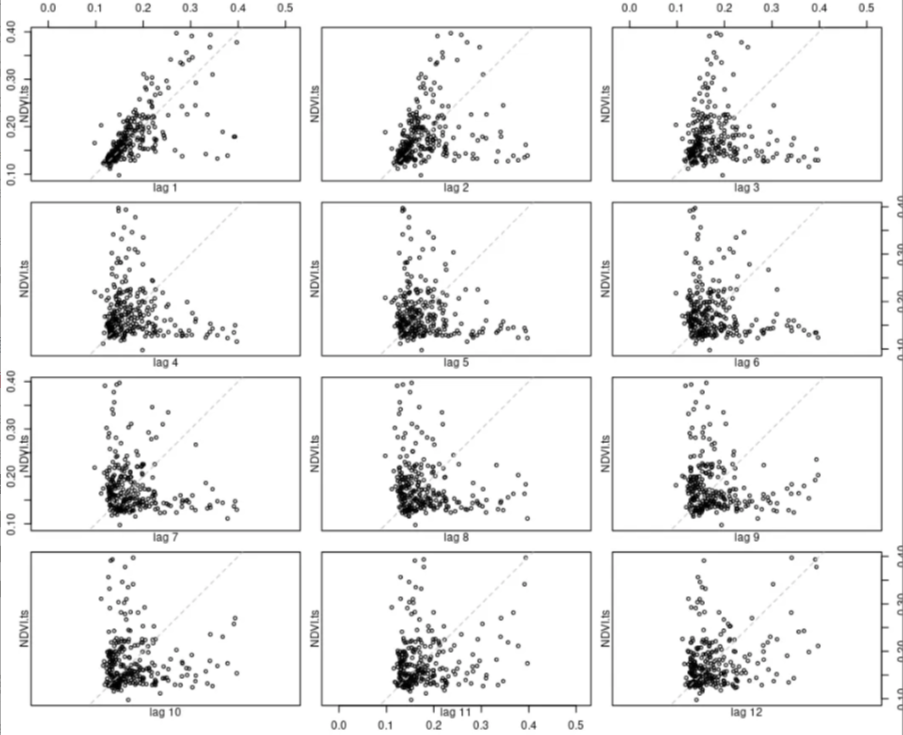
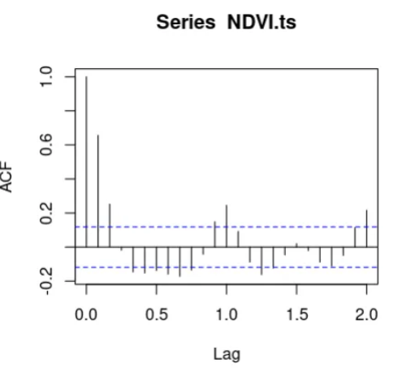

# Time Series Analysis using ACF

## Overview
This script performs time series analysis on NDVI (Normalized Difference Vegetation Index), rainfall, and rodent population data, while also comparing them with a white noise series. The key focus is on identifying trends, seasonality, and autocorrelation using lag plots and the autocorrelation function (ACF).

## Requirements
- R installed on your system
- The dataset `portal_timeseries.csv` containing the following columns:
  - `NDVI`: Vegetation greenness index
  - `rain`: Rainfall measurements
  - `rodents`: Rodent population data

## Code Breakdown

- Plotting NDVI time series & white noise with lags to prove randomness and that the time series taken in uncorrelated.

- Plotting white Noise & plotting the Lag Plot to prove the existence of correlation between time series and its lagged values : not a random pattern, prove the existance of seasonality that is repeating each year(lag).

