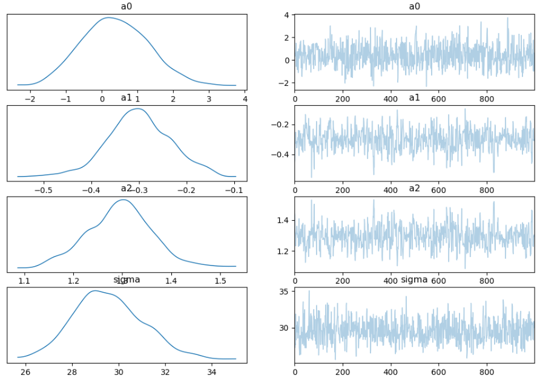

# Bayesian Autoregressive (BAR) Model

This repository contains an R script to implement a **Bayesian Autoregressive (BAR)** model using the `brms` package. The model is applied to a simulated time series dataset, and the results are visualized.

---

## Model Description

The Bayesian Autoregressive (BAR) model is a Bayesian approach to the traditional autoregressive (AR) model. The model structure is:

\[
Y_t = a_0 + a_1 Y_{t-1} + \dots + a_p Y_{t-p} + \epsilon_t
\]

Where:
- \(Y_t\) is the time series value at time \(t\).
- \(a_0, a_1, \dots, a_p\) are the autoregressive coefficients.
- \(\epsilon_t\) is the error term, assumed to be normally distributed.

The key difference from the traditional AR model is that the BAR model incorporates **prior distributions** for the parameters and estimates their **posterior distributions** using Bayesian inference.

---

## Requirements

To run the R script, you need the following:
- R installed on your machine.
- The `brms` and `ggplot2` packages installed in R. You can install them using:
  ```R
  install.packages("brms")
  install.packages("ggplot2")




