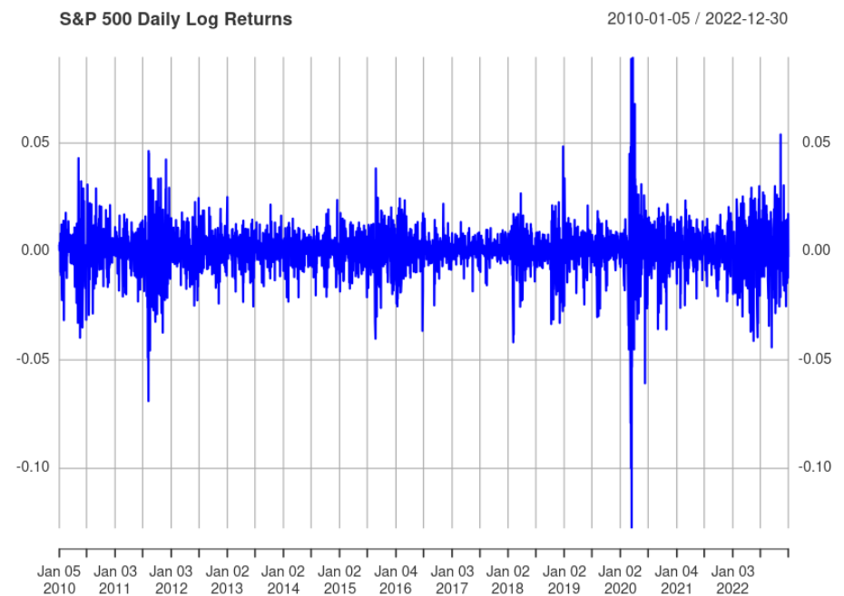
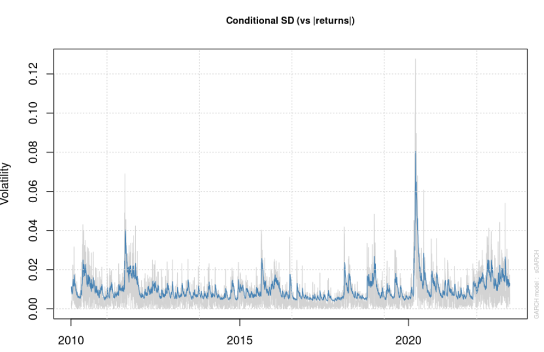
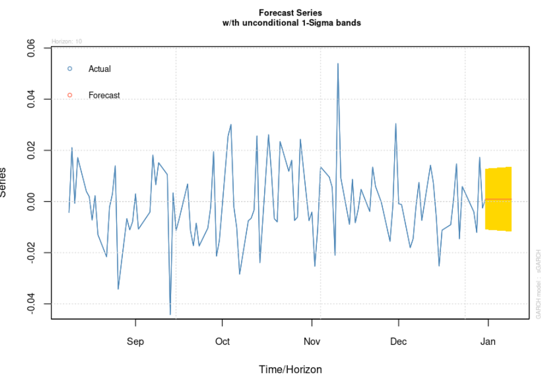

# GARCH Model in R

This repository contains an R script to implement a **GARCH (Generalized Autoregressive Conditional Heteroscedasticity)** model using the `rugarch` package. The model is applied to the daily log returns of the S&P 500 index, and the results are visualized.

---

## Model Description

The GARCH model is used to model time-varying volatility in financial time series. It extends the ARCH model by including lagged conditional variances in the volatility equation.

For a GARCH(1,1) model, the conditional variance \(\sigma_t^2\) is modeled as:

\[
\sigma_t^2 = \alpha_0 + \alpha_1 r_{t-1}^2 + \beta_1 \sigma_{t-1}^2
\]

Where:
- \(\alpha_0\): Constant term.
- \(\alpha_1\): Coefficient for the lagged squared returns (ARCH term).
- \(\beta_1\): Coefficient for the lagged conditional variance (GARCH term).
- \(r_t\): The return at time \(t\).

---

## Requirements

To run the R script, you need the following:
- R installed on your machine.
- The `rugarch` and `quantmod` packages installed in R. You can install them using:
  ```R
  install.packages("rugarch")
  install.packages("quantmod")









