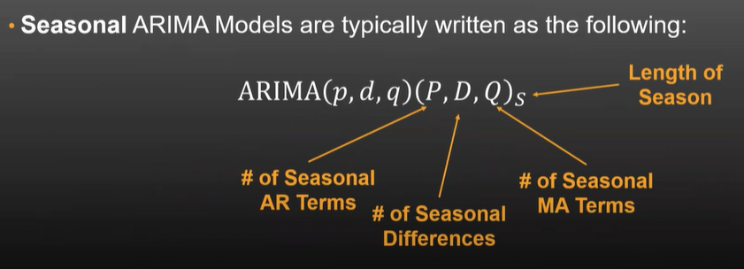
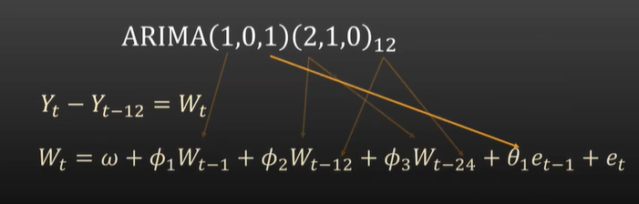
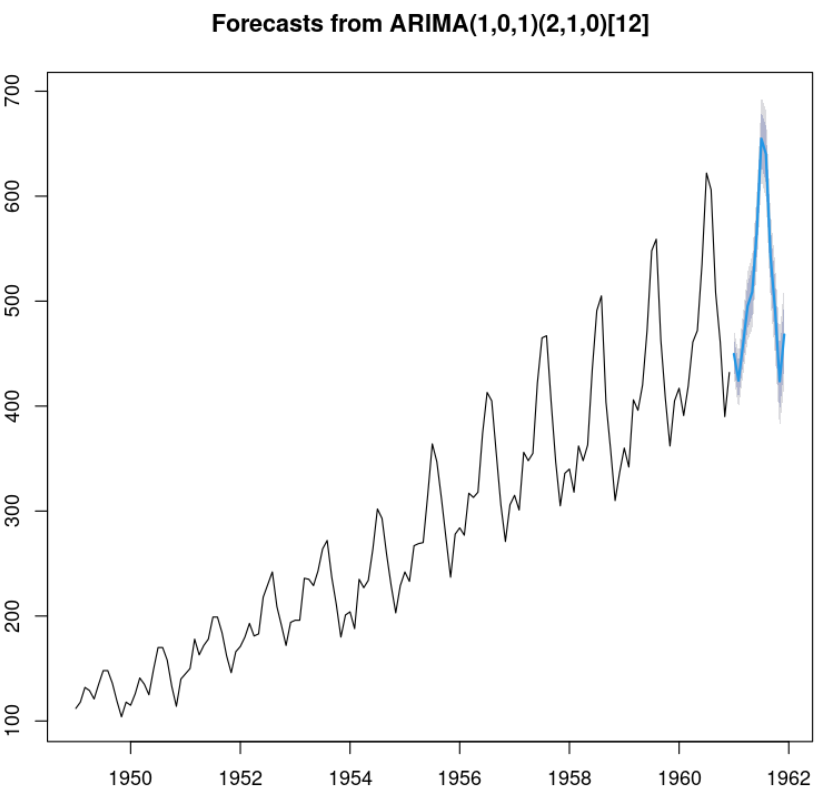

# Seasonal ARIMA (SARIMA) Model Example

This repository contains an R script to fit a specific Seasonal ARIMA (SARIMA) model, `ARIMA(1, 0, 1)(2, 1, 0)[12]`, to a time series dataset. The model is implemented using the `forecast` package in R.

## Model Description

The SARIMA model is defined as:

\[
Y_t - Y_{t-12} = W_t
\]

\[
W_t = \omega + \phi_1 W_{t-1} + \phi_2 W_{t-12} + \phi_3 W_{t-24} + \theta_1 e_{t-1} + e_t
\]

Where:
- \(Y_t\) is the time series data.
- \(W_t\) is the differenced series.
- \(\phi_1, \phi_2, \phi_3\) are the autoregressive (AR) coefficients.
- \(\theta_1\) is the moving average (MA) coefficient.
- \(e_t\) is the error term.

## Requirements

To run the R script, you need the following:
- R installed on your machine.
- The `forecast` package installed in R. You can install it using:
  ```R
  install.packages("forecast")




