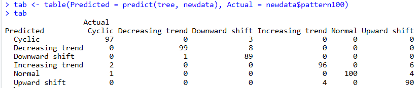
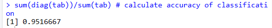

# Time Series Classification

This R script performs classification on synthetic control chart time series data using a decision tree model. The goal is to classify time series into predefined patterns such as 'Normal', 'Cyclic', 'Increasing trend', etc.

## Description

The script reads a dataset of synthetic control charts, prepares the data by labeling the patterns, and applies a decision tree model for classification. The performance of the classification is evaluated by calculating the accuracy.

## Dataset

The dataset used in this script is from the UCI Machine Learning Repository:
[Synthetic Control Chart Time Series](http://kdd.ics.uci.edu/databases/synthetic_control/synthetic_control.html)

## Requirements

- R programming language
- `party` package for decision tree classification

## Installation

To install the required R package, run the following command in your R environment:

```R
install.packages("party")




