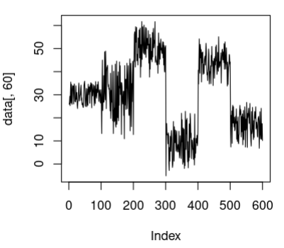
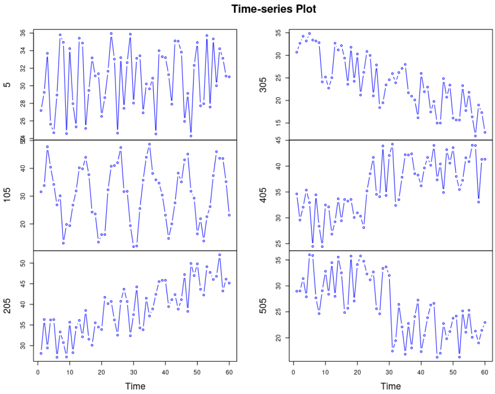
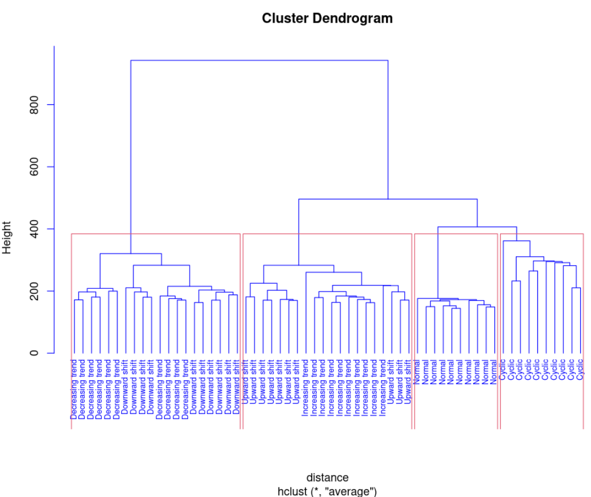

# Time Series Clustering

This R script performs hierarchical clustering on synthetic control chart time series data using Dynamic Time Warping (DTW) for distance measurement.

## Description

The script reads a dataset of synthetic control charts, performs systematic random sampling, and applies hierarchical clustering to group similar time series patterns. The clustering is visualized using a dendrogram.

## Dataset

The dataset used in this script is from the UCI Machine Learning Repository:
[Synthetic Control Chart Time Series](http://kdd.ics.uci.edu/databases/synthetic_control/synthetic_control.html)

## Requirements

- R programming language
- `dtw` package for Dynamic Time Warping

## Installation

To install the required R package, run the following command in your R environment:

```R
install.packages("dtw")





hierarchical clustering

