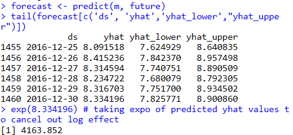

# Wikipedia Trend Data Analysis and Forecasting

This R script retrieves Wikipedia page view data for a specific topic (e.g., "Tom Brady"), handles missing data, and performs time series forecasting using Facebook's Prophet.

## Description

The script uses the `wikipediatrend` package to fetch Wikipedia page view data for a specified date range. It then preprocesses the data, handles missing values, and applies a log transformation. Finally, it uses Facebook's Prophet library to forecast future page views.

## Requirements

- R programming language
- `wikipediatrend` package for fetching Wikipedia trend data
- `ggplot2` package for data visualization
- `prophet` package for time series forecasting

## Installation

To install the required R packages, run the following commands in your R environment:

```R
install.packages("remotes")
remotes::install_github("petermeissner/wikipediatrend")
install.packages("ggplot2")
install.packages("prophet")


after log transformation: seasonality is more visible using log





