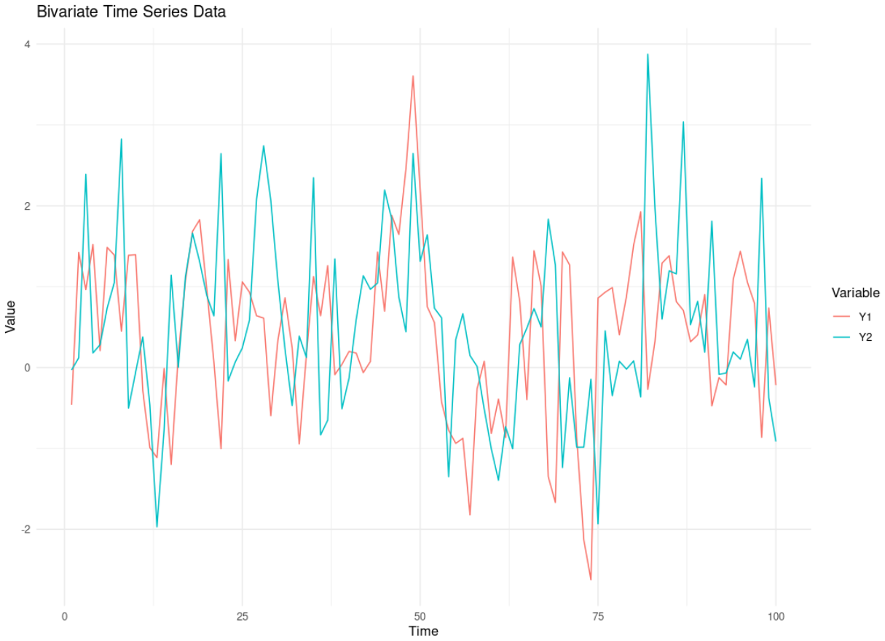
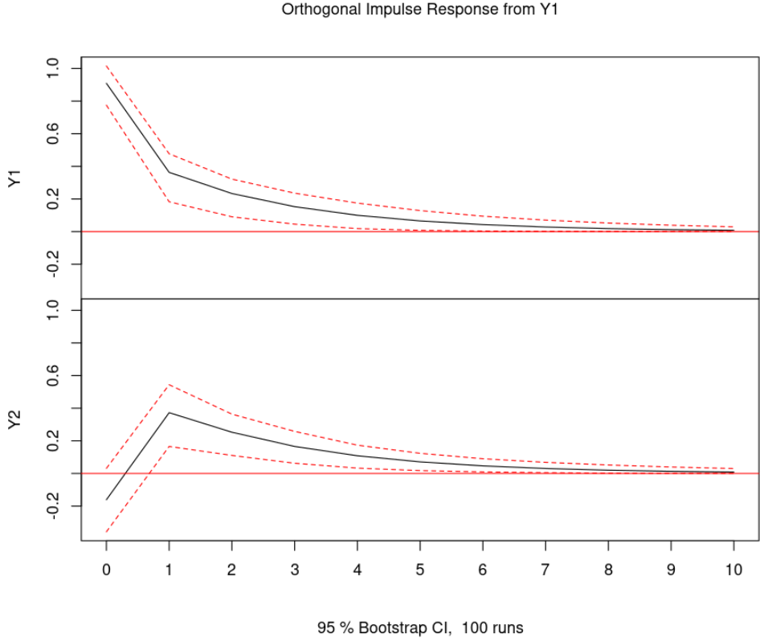
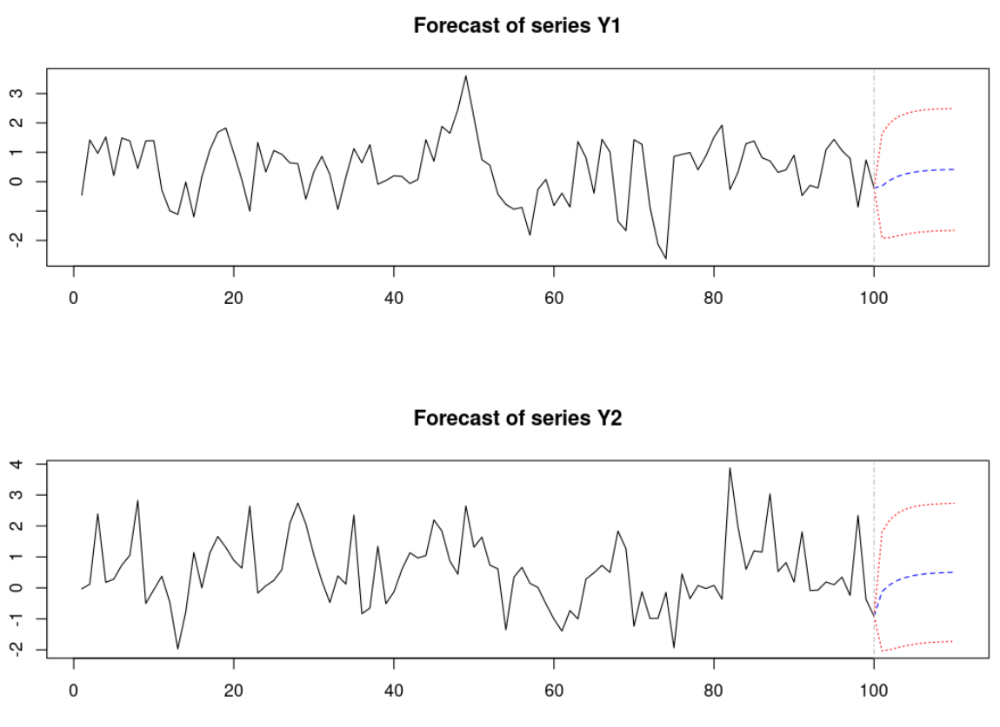

# Vector Autoregressive (VAR) Model in R

This repository contains an R script to implement a **Vector Autoregressive (VAR)** model using the `vars` package. The model is applied to a bivariate time series dataset, and the results are visualized.

---

## Model Description

The Vector Autoregressive (VAR) model is an extension of the univariate AR model to multivariate time series. It models each variable as a linear function of its own past values and the past values of the other variables in the system.

For a bivariate VAR(1) model, the equations are:

\[
\begin{bmatrix}
Y_{t,1} \\
Y_{t,2}
\end{bmatrix}
=
\begin{bmatrix}
\alpha_{0,1} \\
\alpha_{0,2}
\end{bmatrix}
+
\begin{bmatrix}
\alpha_{11,1} & \alpha_{12,1} \\
\alpha_{21,1} & \alpha_{22,1}
\end{bmatrix}
\begin{bmatrix}
Y_{t-1,1} \\
Y_{t-1,2}
\end{bmatrix}
+
\begin{bmatrix}
e_{t,1} \\
e_{t,2}
\end{bmatrix}
\]

Where:
- \(Y_{t,1}\) and \(Y_{t,2}\) are the values of the two variables at time \(t\).
- \(\alpha_{0,1}\) and \(\alpha_{0,2}\) are the intercepts.
- \(\alpha_{11,1}\), \(\alpha_{12,1}\), \(\alpha_{21,1}\), and \(\alpha_{22,1}\) are the autoregressive coefficients.
- \(e_{t,1}\) and \(e_{t,2}\) are the error terms.

---

## Requirements

To run the R script, you need the following:
- R installed on your machine.
- The `vars` and `ggplot2` packages installed in R. You can install them using:
  ```R
  install.packages("vars")
  install.packages("ggplot2")






